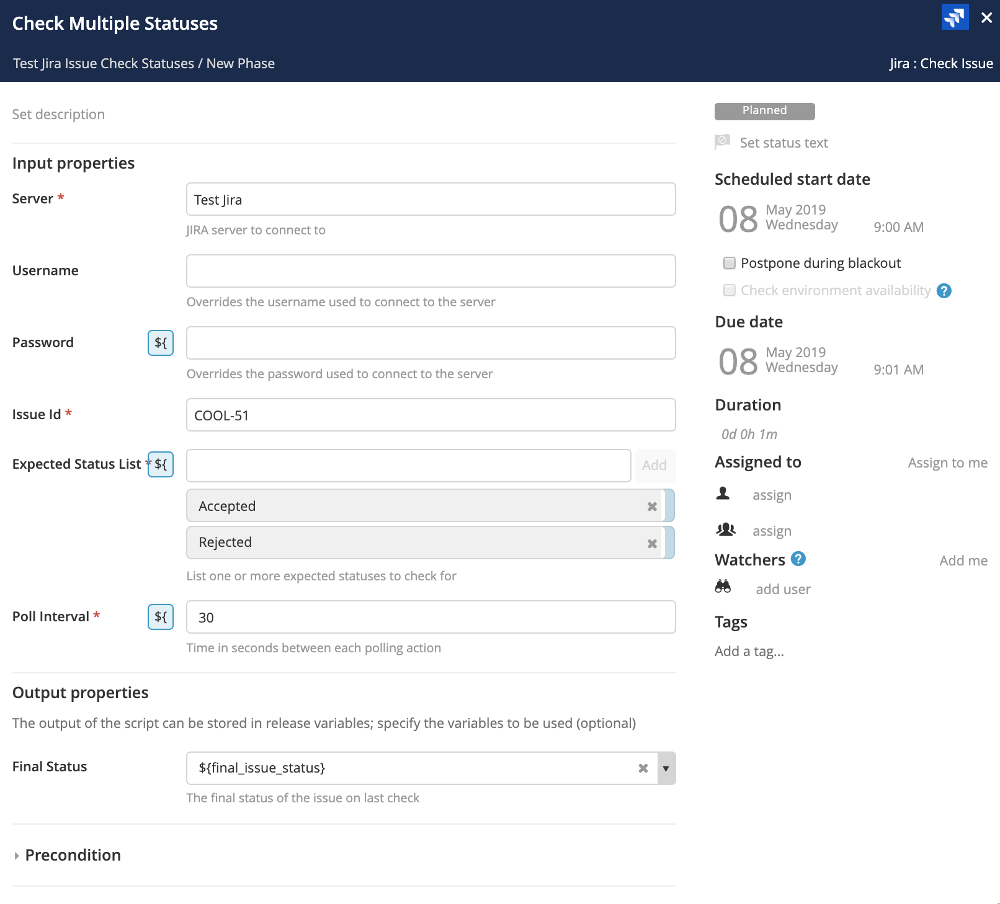
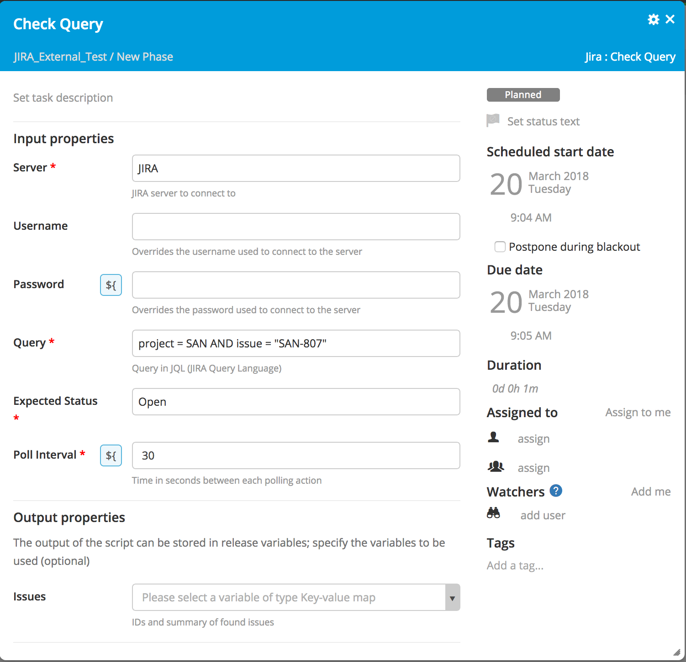
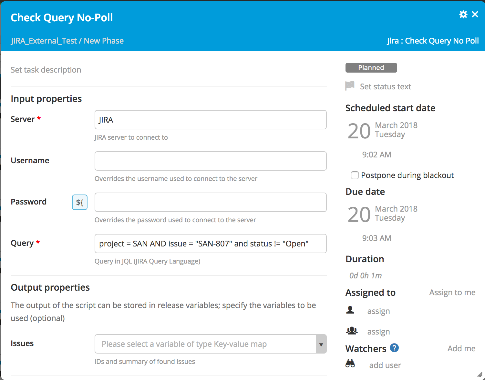
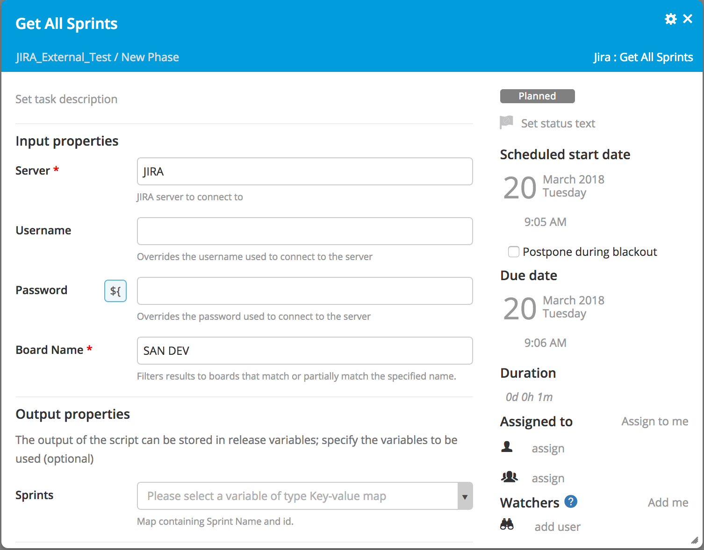
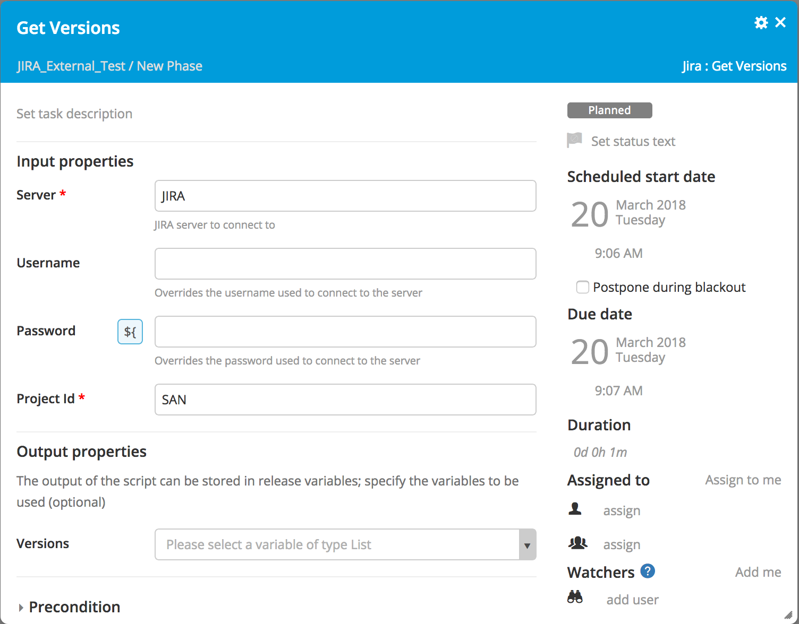
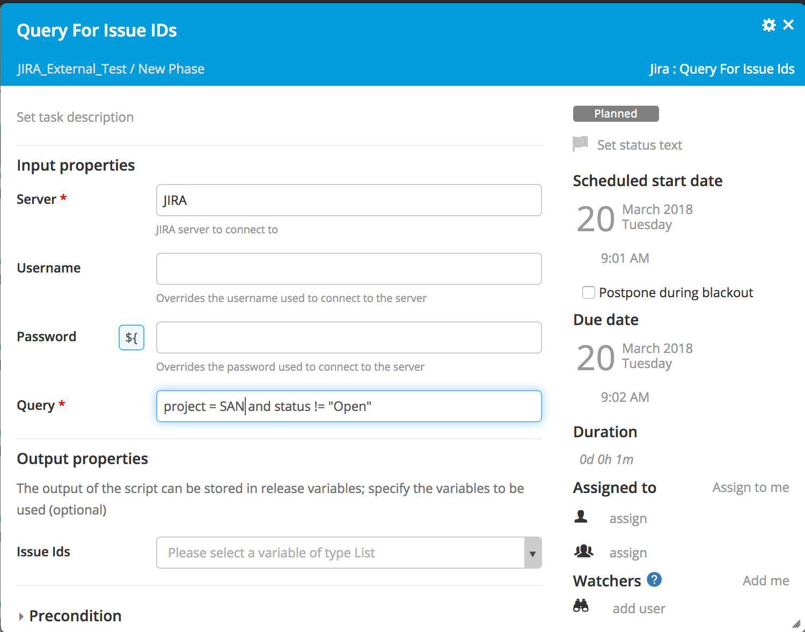
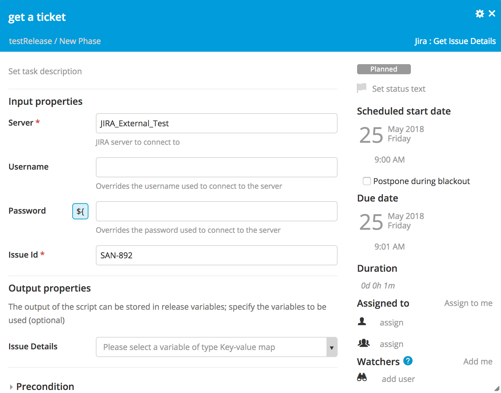
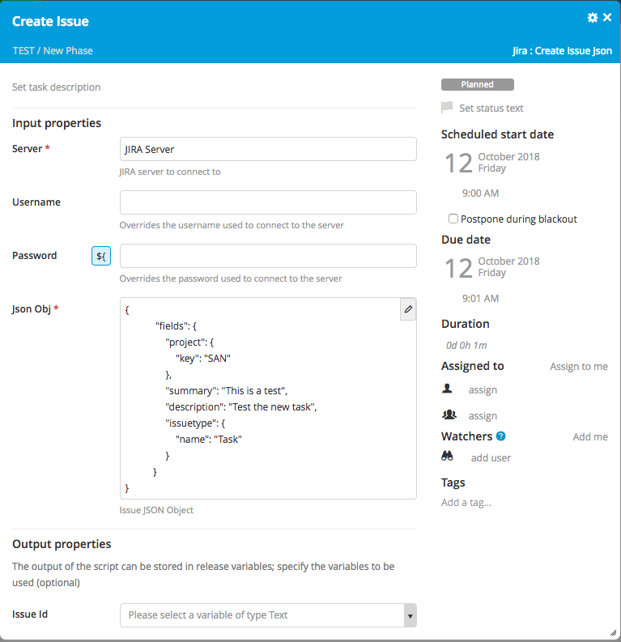

# Preface #

This document describes the functionality provided by the xlr-jira-extension-plugin.

See the **[XL Release Documentation](https://docs.xebialabs.com/xl-release/index.html)** for background information on XL Release and release concepts.

# CI status #

[![Build Status][xlr-jira-extension-plugin-travis-image] ][xlr-jira-extension-plugin-travis-url]
[![Codacy][xlr-jira-extension-plugin-codacy-image] ][xlr-jira-extension-plugin-codacy-url]
[![Code Climate][xlr-jira-extension-plugin-code-climate-image] ][xlr-jira-extension-plugin-code-climate-url]
[![License: MIT][xlr-jira-extension-plugin-license-image] ][xlr-jira-extension-plugin-license-url]

[xlr-jira-extension-plugin-travis-image]: https://travis-ci.org/xebialabs-community/xlr-jira-extension-plugin.svg?branch=master
[xlr-jira-extension-plugin-travis-url]: https://travis-ci.org/xebialabs-community/xlr-jira-extension-plugin
[xlr-jira-extension-plugin-codacy-image]: https://api.codacy.com/project/badge/Grade/b92a4ed7e0be40c98a77737884ce2f8d
[xlr-jira-extension-plugin-codacy-url]: https://www.codacy.com/app/rvanstone/xlr-jira-extension-plugin
[xlr-jira-extension-plugin-code-climate-image]: https://codeclimate.com/github/xebialabs-community/xlr-jira-extension-plugin/badges/gpa.svg
[xlr-jira-extension-plugin-code-climate-url]: https://codeclimate.com/github/xebialabs-community/xlr-jira-extension-plugin
[xlr-jira-extension-plugin-license-image]: https://img.shields.io/badge/License-MIT-yellow.svg
[xlr-jira-extension-plugin-license-url]: https://opensource.org/licenses/MIT

# Overview #

The xlr-jira-extension-plugin provides additional Jira tasks beyond the default Create Issue and Update Issue supplied by default with XL Release.

## Installation ##

Place the latest released version under the `plugins` dir.

## Types ##

### JiraTrigger

Trigger when a new issue appears top of the search results of a JQL query (like a new release issue, a specific subtask, etc).

### Check Issue

+ Check Issue (statuses) - Polls Jira to check the status of a Issue. It will complete once the issue is in the correct state
  * `jiraServer` - Jira server from the Configuration screen in XL Release
  * `username` - Optional username override for the connection to Jira
  * `password` - Optional password override for the connection to Jira
  * `issueId` - Jira issue ID to check, e.g. SAN-672
  * `expectedStatusList` - This is the Jira statuses to complete on, the task will poll until one of these status is met. This checks for a status name, e.g. "Resolved". To double check the case of a status, export an issue to XML and check the value of the status field.
  * `pollInterval` - Interval in seconds between polling actions
  * `finalStatus` - Output property that will contain the final status. This can be saved in a release variable and used later in the release.
### Check Query

### Check Query No Poll

### Get All Sprints

+ Get All Sprints - Get all sprints for a certain board name
  * `jiraServer` - Jira server from the Configuration screen in XL Release
  * `username` - Optional username override for the connection to Jira
  * `password` - Optional password override for the connection to Jira
  * `boardName` - Filters results to boards that match or partially match the specified name.
  * `sprints` - Output property - Map containing Sprint Name and id.

### Get Versions

### Query For All Issue IDs

+ Check Status - Polls Jira to check the status of a Issue, will complete once the issue is in the correct state
  * `jiraServer` - Jira server from the Configuration screen in XL Release
  * `username` - Optional username override for the connection to Jira
  * `password` - Optional password override for the connection to Jira
  * `issueId` - Jira issue ID to check, e.g. SAN-672
  * `expectedStatus` - This is the Jira status to complete on, the task will poll until this status is met. This checks for a status name, e.g. "Resolved". To double check the case of a status, export an issue to XML and check the value of the status field.
  * `pollInterval` - Interval in seconds between polling actions

### Get Issue Details

+ Get the details for a specific ticket
 * `Issue Id` - Issue Ticket

### Create Issue JSON

Create a JIRA Issue with required fields using a JSON object to specify all of the required fields

